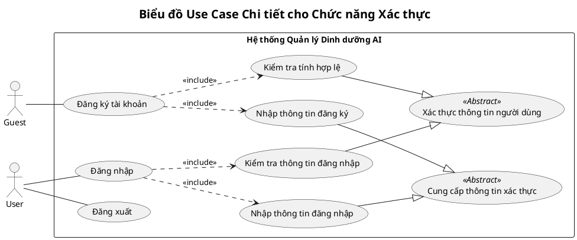

## Biểu đồ Use Case Chi tiết - Chức năng Xác thực

### **Giải thích biểu đồ:**

- **Actors:**
  - `Guest`: Người dùng chưa có tài khoản, chỉ có thể thực hiện chức năng `Đăng ký tài khoản`.
  - `User`: Người dùng đã đăng nhập, có thể thực hiện `Đăng nhập` và `Đăng xuất`.

- **Use Cases chính:**
  - `Đăng ký tài khoản`: Cho phép `Guest` tạo tài khoản mới.
  - `Đăng nhập`: Cho phép `User` truy cập vào hệ thống.
  - `Đăng xuất`: Cho phép `User` kết thúc phiên làm việc.

- **Use Cases trừu tượng (Abstract):**
  - `Cung cấp thông tin xác thực`: Tổng quát hóa hành động nhập liệu của người dùng (tên, email, mật khẩu).
  - `Xác thực thông tin người dùng`: Tổng quát hóa hành động kiểm tra và xác thực dữ liệu từ phía hệ thống.

- **Mối quan hệ `<<include>>`:**
  - `Đăng ký` bao gồm các bước bắt buộc là `Nhập thông tin đăng ký` và `Kiểm tra tính hợp lệ`.
  - `Đăng nhập` bao gồm các bước bắt buộc là `Nhập thông tin đăng nhập` và `Kiểm tra thông tin đăng nhập`.

- **Mối quan hệ `Generalization` (Mũi tên tam giác trắng):**
  - `Nhập thông tin đăng ký` và `Nhập thông tin đăng nhập` là các trường hợp cụ thể của `Cung cấp thông tin xác thực`.
  - `Kiểm tra tính hợp lệ` và `Kiểm tra thông tin đăng nhập` là các trường hợp cụ thể của `Xác thực thông tin người dùng`.
